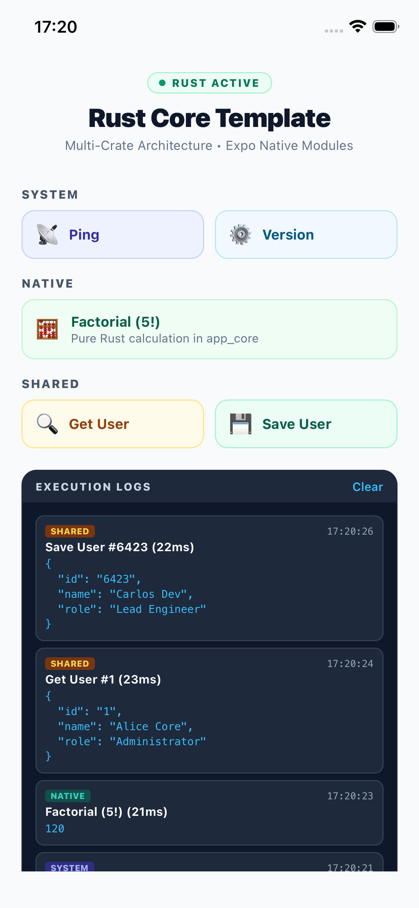

# React Native Rust Template

A minimal, production-ready Expo template for calling Rust code from React Native on iOS and Android.

<p align="center">
  
</p>

## Overview

This template shows how to run shared Rust business logic inside a React Native app. It uses Expo Native Modules, C FFI for iOS, and JNI for Android.

### Highlights

- **Multi-Crate Workspace**: Decouples domain logic (`crates/app_core`) from mobile bridge code (`rust-core`).
- **Async Runtime**: Powered by Tokio multi-threading to keep the main JS thread non-blocking.
- **Panic Protection**: Intercepts Rust panics with `catch_unwind` and returns typed errors.
- **Automated Builds**: Lifecycle hooks (`preios`/`preandroid`) via `scripts/setup.js` and Expo Config Plugin (`plugins/withRust.js`) handle target compilation and binary placement automatically.

---

## Workspace Structure

```text
.
├── Cargo.toml                    # Root Cargo workspace
├── package.json                  # App dependencies & build scripts
├── scripts/
│   └── setup.js                  # Unified setup & Rust compilation script
├── plugins/
│   └── withRust.js               # Expo Config Plugin for build automation
├── crates/
│   └── app_core/                 # Core domain logic (pure Rust, no FFI)
│       └── src/lib.rs            # Business logic, models, & errors
├── rust-core/                    # FFI bridge layer
│   └── src/
│       ├── lib.rs                # C FFI & Android JNI entry points
│       ├── dispatcher.rs         # Command router & JSON serializer
│       ├── error.rs              # BridgeError mapping
│       ├── state.rs              # Global state instance
│       └── handlers/             # Modular request handlers (system, math, user)
├── modules/
│   └── rust-bridge/              # Expo Native Module
│       ├── ios/RustBridgeModule.swift
│       ├── android/.../RustBridgeModule.kt
│       └── src/index.ts          # TypeScript client
└── App.tsx                       # UI demo
```

---

## How Rust is Linked in Expo

Expo CLI (`npx expo start`) bundles JavaScript, while Expo Prebuild (`npx expo run:android` / `npx expo run:ios`) compiles native code.

To call Rust from React Native:
1. Rust is cross-compiled for target architectures (`aarch64-linux-android` / `aarch64-apple-ios-sim`) with `IPHONEOS_DEPLOYMENT_TARGET=16.0`.
2. Compiled binaries are placed in `modules/rust-bridge/android/src/main/jniLibs` and `modules/rust-bridge/ios/lib`.
3. Expo prebuild links the Rust library into the native iOS/Android binaries.
4. Heavy binary files (`*.a` / `*.so`) are ignored in `.gitignore`, while `.gitkeep` files keep the target folder structure tracked for clean git clones and EAS Build pipelines.

NPM lifecycle hooks (`preios` and `preandroid`) execute `scripts/setup.js` automatically prior to `expo run`.

---

## Getting Started

### Prerequisites

- Node.js 18+ and npm
- Rust toolchain (`rustup`)
- `cargo-ndk` for Android builds:
  ```bash
  cargo install cargo-ndk
  ```

### Setup

```bash
# Add target toolchains and install npm dependencies
npm run setup
```

### Running the App

```bash
# Run on Android (compiles Rust via cargo-ndk -> runs expo run:android)
npm run android

# Run on iOS Simulator (macOS only, compiles Rust -> runs expo run:ios)
npm run ios
```

### Standalone Rust Compilation

If you want to build the Rust binaries without launching the emulator:

```bash
node scripts/setup.js android
node scripts/setup.js ios
```

---

## How to Call Rust from TypeScript

```typescript
import { callRust } from "rust-bridge";

// Call a handler defined in rust-core/src/handlers/
async function calculateFactorial() {
  try {
    const result = await callRust<number>("math", {
      type: "factorial",
      n: 5,
    });
    console.log("Result:", result); // 120
  } catch (error) {
    console.error("Rust Error:", error);
  }
}
```

---

## Customizing Package Name / App Namespace

If you change the Android package name (e.g., from `com.myapp.rustbridge` to `com.yourcompany.app`), you **must** update the JNI function signature in `rust-core/src/lib.rs`:

1. **Android JNI Function (`rust-core/src/lib.rs`)**:
   Rename `Java_com_myapp_rustbridge_RustBridgeModule_callRustNative` to match your new Android package path (replacing dots with underscores):
   ```rust
   // For package com.yourcompany.app:
   pub extern "system" fn Java_com_yourcompany_app_RustBridgeModule_callRustNative(...)
   ```

2. **Android Package Namespace (`modules/rust-bridge/android/build.gradle`)**:
   Update `namespace` in the `android {}` block to match your target package:
   ```groovy
   android {
     namespace "com.yourcompany.app"
   }
   ```

---

## License

MIT
