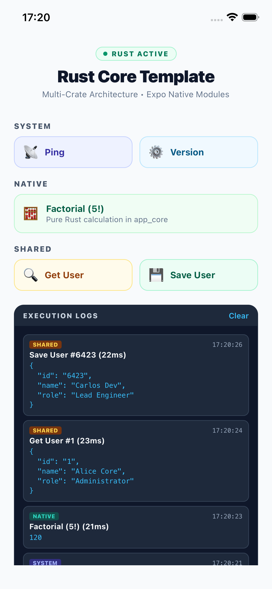

# React Native Rust Template

A minimal, production-ready Expo template for calling Rust code from React Native on iOS and Android.

<p align="center">
  
</p>

## Overview

This template shows how to run shared Rust business logic inside a React Native app. It uses Expo Native Modules, C FFI for iOS, and JNI for Android.

### Highlights

- **Typed End to End**: Rust's `BridgeCommand` enum is exported to TypeScript with `ts-rs`, and `callRust()` takes exactly that type. A wrong command name or a missing argument fails `tsc`, not the app at runtime.
- **Multi-Crate Workspace**: Decouples domain logic (`crates/app_core`) from mobile bridge code (`rust-core`).
- **Off-Thread by Default**: Calls run on the platform's background queue (Expo's serial `AsyncFunction` queue on iOS, `Dispatchers.IO` on Android), so the JS thread never blocks. No async runtime is bundled — handlers are synchronous.
- **Panic Protection**: Intercepts Rust panics with `catch_unwind` and returns typed errors (`panic = "unwind"` is pinned in the workspace release profile, which `catch_unwind` depends on).
- **Injection-Proof Boundary**: Command and args cross as one `JSON.stringify`d envelope that Rust parses once. Nothing is ever concatenated into JSON at the FFI layer.
- **Automated Builds**: `scripts/setup.js` compiles Rust for every target — an XCFramework (device + simulator) on iOS, three ABIs on Android — from the `preios`/`preandroid` hooks, the Expo Config Plugin (`plugins/withRust.js`) during prebuild, and the EAS pre-install hook.
- **Structured Logging**: `tracing` events from Rust reach logcat / the Xcode console.

---

## Workspace Structure

```text
.
├── Cargo.toml                    # Root Cargo workspace (+ `mobile-dev` profile)
├── .cargo/config.toml            # ts-rs output dir, Android 16 KB page alignment
├── package.json                  # App dependencies & build scripts
├── eas.json                      # EAS Build profiles
├── scripts/
│   └── setup.js                  # Unified setup & Rust compilation script
├── plugins/
│   └── withRust.js               # Expo Config Plugin: builds Rust during prebuild
├── bindings/                     # Generated TS types (ts-rs) — committed, never edited
├── crates/
│   └── app_core/                 # Core domain logic (pure Rust, no FFI)
│       └── src/lib.rs            # Business logic, models, & errors
├── rust-core/                    # FFI bridge layer
│   ├── src/
│   │   ├── lib.rs                # C FFI & Android JNI entry points, logging
│   │   ├── dispatcher.rs         # BridgeCommand (exported to TS) & router
│   │   ├── error.rs              # BridgeError mapping
│   │   ├── state.rs              # Global state instance
│   │   ├── safe_int.rs           # SafeInt<T>: wire-safe 64-bit+ integers
│   │   ├── wire.rs               # Wire::encode, the one place a response is encoded
│   │   └── handlers/             # Modular request handlers (system, math, user)
│   └── tests/
│       ├── ts_export_int_safety.rs  # No raw 64-bit ints in exported types
│       └── jni_symbol.rs            # JNI symbol matches the Kotlin module
├── modules/
│   └── rust-bridge/              # Expo Native Module
│       ├── ios/RustBridgeModule.swift
│       ├── android/.../RustBridgeModule.kt
│       └── src/index.ts          # TypeScript client (+ index.test.ts)
├── src/
│   ├── i18n/                     # Locale catalogs & BridgeError translation
│   ├── hooks/useRustBridge.ts    # Bridge call + logging hook
│   └── utils/describeError.ts    # Error -> user-facing string (+ .test.ts)
└── App.tsx                       # UI demo
```

---

## How Rust is Linked in Expo

Expo CLI (`npx expo start`) bundles JavaScript, while Expo Prebuild (`npx expo run:android` / `npx expo run:ios`) compiles native code. Custom native code means **Expo Go and web are not supported** — the app has to be built with `npm run ios` / `npm run android` (or EAS).

`scripts/setup.js` compiles `rust-core` and puts the result where the native module expects it:

- **iOS**: device (`aarch64-apple-ios`) and simulator slices are packaged into `modules/rust-bridge/ios/RustBridge.xcframework`, so Xcode links the right one for any destination — simulator, a physical device, or an archive. Deployment target is iOS 16.4 (Expo SDK 57's minimum).
- **Android**: `cargo-ndk` builds `librust_bridge.so` for `arm64-v8a`, `armeabi-v7a`, and `x86_64` into `modules/rust-bridge/android/src/main/jniLibs`.

It runs from three places, so every build path gets a fresh library:

1. `preios` / `preandroid` npm hooks, before `expo run`.
2. The config plugin, during `expo prebuild` (also how EAS gets it).
3. `eas-build-pre-install`, which installs Rust and `cargo-ndk` on EAS build machines.

Compiled binaries are git-ignored.

### Build Profiles

| When                                 | Cargo profile | What it does                                     |
| ------------------------------------ | ------------- | ------------------------------------------------ |
| Local (`npm run ios` / `android`)    | `mobile-dev`  | Release semantics, no LTO: fast loop             |
| EAS Build, or `RUST_PROFILE=release` | `release`     | Fat LTO, 1 codegen unit: smallest/fastest binary |

Local builds carry only the host's simulator architecture; release builds add the other one. For an optimized local build: `RUST_PROFILE=release npm run ios`.

---

## Getting Started

### Prerequisites

- Node.js 20.19.4+ (or 22.13+ / 24.3+) and npm
- Expo SDK 57 (React Native 0.86)
- Rust toolchain (`rustup`), Rust 1.80+
- Xcode 26 for iOS (macOS only)
- `cargo-ndk` for Android builds:
  ```bash
  cargo install cargo-ndk
  ```

### Setup

```bash
# Add target toolchains and install npm dependencies
npm run setup
```

### Running the App

```bash
# Run on Android (compiles Rust via cargo-ndk -> runs expo run:android)
npm run android

# Run on iOS (macOS only, compiles the Rust XCFramework -> runs expo run:ios)
npm run ios
npm run ios -- --device   # physical device: same XCFramework, no rebuild needed
```

### Standalone Rust Compilation

If you want to build the Rust binaries without launching the emulator:

```bash
node scripts/setup.js android
node scripts/setup.js ios
```

---

## How to Call Rust from TypeScript

```typescript
import { callRust } from "rust-bridge";

// Call a handler defined in rust-core/src/handlers/
async function calculateFactorial() {
  try {
    // `{ cmd, args }` is type-checked against the generated BridgeCommand.
    // Result is a string: 64-bit values cross the wire as decimal strings —
    // JS numbers are f64 and would round anything past 2^53.
    const result = await callRust<string>({
      cmd: "math",
      args: { type: "factorial", n: 5 },
    });
    console.log("Result:", result); // "120"
  } catch (error) {
    console.error("Rust Error:", error);
  }
}
```

The command is typed; the result type `T` is still declared by the caller.

---

## Adding a New Rust Command

1. **Domain logic** (`crates/app_core/src/lib.rs`): write the pure Rust function/struct. Derive `#[derive(TS)]` + `#[ts(export)]` on any type you want mirrored in TypeScript.
2. **Errors** (`rust-core/src/error.rs`): if the operation can fail, add a variant to `CoreError` and map it in the `From<CoreError> for BridgeError` impl.
3. **Handler** (`rust-core/src/handlers/`): add or extend a `<Name>Command` enum (`#[derive(Deserialize, TS)]`, `#[serde(tag = "type")]`) and its `dispatch()` match arm, calling into the domain logic via `CORE_SERVICE` and returning `Wire::encode(&value)` (`rust-core/src/wire.rs`). `Wire::encode` only accepts types implementing `SafeForWire` (add an `impl` for new response types), which is what forces a 64-bit+ value through `SafeInt<T>` (`rust-core/src/safe_int.rs`) instead of a bare `u64`/`i64`.
4. **Dispatcher** (`rust-core/src/dispatcher.rs`): add the handler's command enum as a variant of `BridgeCommand` and route it in `BridgeDispatcher::run()`. New handler file? Add `pub mod <name>;` to `handlers/mod.rs`.
5. **Regenerate TS types**: run `cargo test --workspace` — every `#[ts(export)]` type (and what it references) is (re)written to `bindings/` as a side effect. Commit the result; CI fails if `bindings/` is stale.
6. **Call it from TypeScript**:
   ```typescript
   const result = await callRust<ReturnType>({
     cmd: "<command>",
     args: { type: "<variant>" /* args */ },
   });
   ```
7. **Localize errors**: if the command can return a `BridgeError`, add its `kind` string to `src/i18n/locales/en.json` and `pt.json` under `"errors"` — `translateBridgeError()` looks it up by `kind` and interpolates the remaining fields.

---

## Testing & Linting

- `npm test` / `npm run lint` / `npm run typecheck` / `npm run format:check` — Jest (`jest-expo` preset), ESLint, `tsc --noEmit`, Prettier. `typecheck` also verifies that malformed commands don't compile (`@ts-expect-error` cases in `modules/rust-bridge/src/index.test.ts`).
- `cargo test --workspace` — Rust unit tests, the int-safety and JNI-symbol guards; also regenerates `bindings/`.
- `cargo clippy --workspace --all-targets -- -D warnings` / `cargo fmt --check` — Rust lint & format.

CI (`.github/workflows/ci.yml`) runs all of the above, checks that `bindings/` is committed and current, and builds the actual app on Android (`assembleDebug`) and iOS (simulator). A Husky pre-commit hook (`npx lint-staged`) formats staged files automatically.

---

## Making It Your App

- **App identity** (`app.json`): `name`, `slug`, `ios.bundleIdentifier`, `android.package` (both `com.example.rnrusttemplate` here).
- **Module metadata** (`modules/rust-bridge/package.json`): `author`, `homepage` — read by the podspec.

The native module's own Kotlin package (`expo.modules.rustbridge`) is independent of your app's `android.package`; there is no reason to rename it. If you do move the Kotlin class, rename the JNI function in `rust-core/src/lib.rs` to match — `rust-core/tests/jni_symbol.rs` fails until they agree, and tells you the expected name.

---

## EAS Build

```bash
npm install -g eas-cli
eas build --platform ios      # or android
```

EAS images don't ship with Rust. The `eas-build-pre-install` script (`node scripts/setup.js eas`) installs `rustup`, the platform's targets, and `cargo-ndk` (Android) before the build; the config plugin then compiles Rust with the `release` profile during prebuild.

---

## License

MIT
